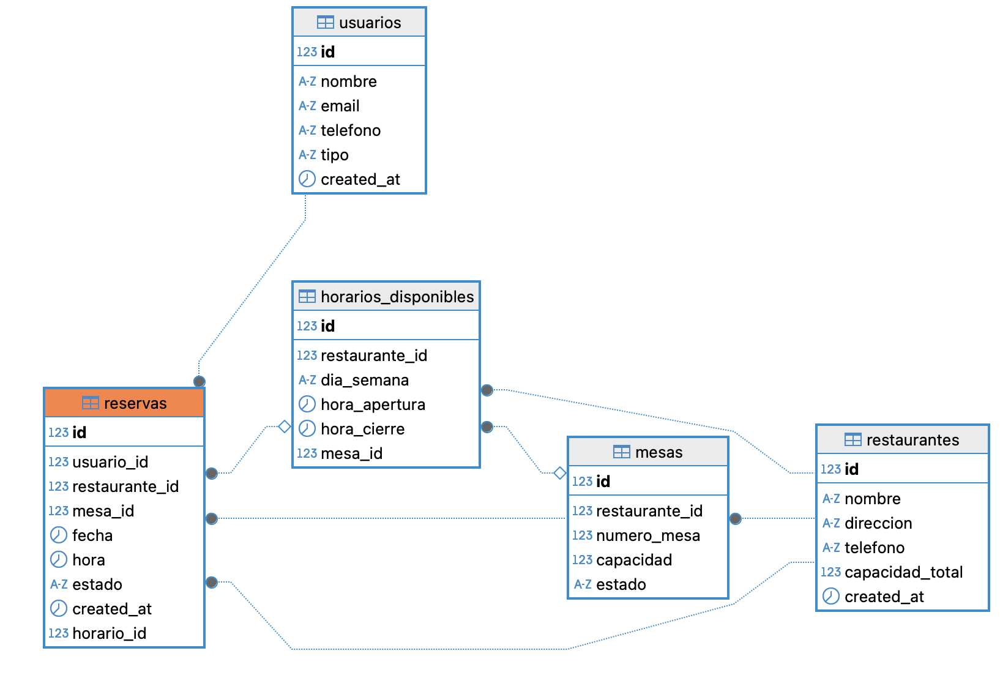
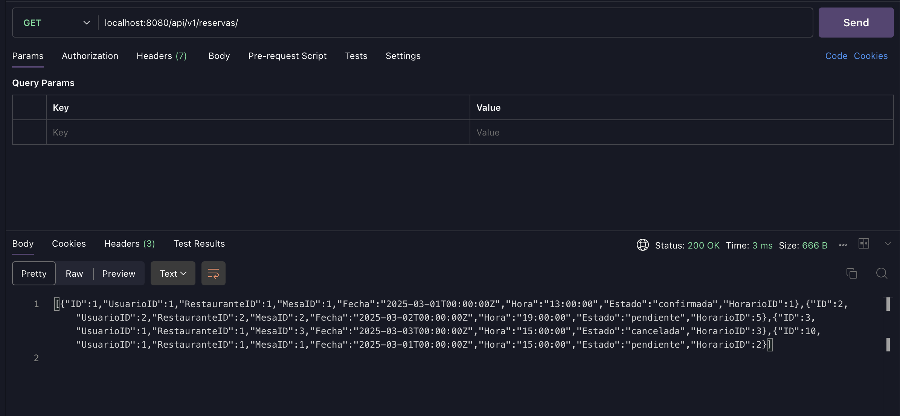
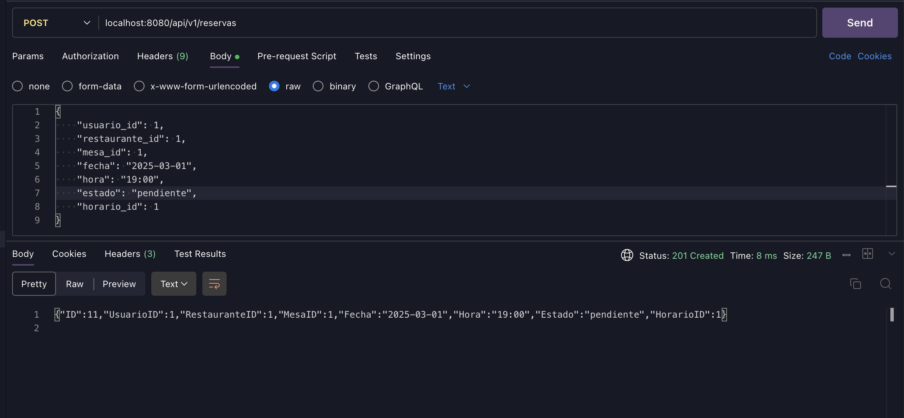
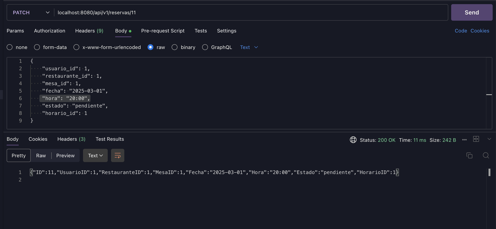

# **Sistema de Reservas - Documentación**

## **🚀 Introducción**
Este sistema de reservas permite gestionar la asignación de mesas en restaurantes, manejando usuarios, horarios disponibles y reservas con distintos estados. La API ha sido construida en **Go** siguiendo una **arquitectura DDD (Domain-Driven Design)** con inyección de dependencias y separación de responsabilidades.

Por cuestiones de tiempo solo se implemento el flujo que permite realizar el CRUD de una reserva, el resto de tablas no fueron implementadas en la API, por lo cual en efectos de la prueba se cargaron con datos de forma manual el resto de tablas para evitar errores de Fk.

## **🚀 Modelo ER**


## **🚀 Arquitectura del Proyecto**
El sistema sigue el patrón **Domain-Driven Design (DDD)**, con una estructura organizada en las siguientes capas:

```
├── cmd/
│   ├── server/
│   │   ├── app.go                   # Configuración de rutas y servidor
│   │   ├── dependency_injection.go  # Inyección de dependencias
│   ├── main.go                      # Punto de entrada del servidor
│
├── infrastructure/
│   ├── db/
│   │   ├── db.go         # Configuración de la base de datos
│
├── internal/
│   ├── config/
│   │   ├── config.go       # Carga de variables de entorno
│   ├── domain/
│   │   ├── dto/            # Definición de DTOs
│   │   │   ├── dtos.go     # DTOs
│   │   ├── model/          # Definición de modelos
|   |   |   ├── models.go   # Models para reservas
│   │   ├── repository/     # Implementación de acceso a datos con su interface
│   │   ├── service/        # Lógica de negocio con su interface
│   │   ├── handler/        # Controladores de la API
│
├── go.mod                     # Módulo de Go
├── go.sum                     # Dependencias
├── README.md                  # Documentación
```

## **🚀 Tecnologías Utilizadas**
- **Go** - Lenguaje principal del backend.
- **MySQL** - Base de datos para almacenar la información.
- **GORM** - ORM para interactuar con la base de datos.
- **Chi Router** - Framework para manejar rutas en Go.

## **🚀 Patrones y Principios Usados**

### **1️⃣ Domain-Driven Design (DDD)**
Separamos la lógica del negocio en **módulos claros** dentro de `internal/domain`, garantizando independencia entre capas:
- **Modelos (`model/`)** definen las estructuras de datos.
- **DTOs (`dto/`)** separan los datos de entrada/salida.
- **Repositorios (`repository/`)** manejan la persistencia en la BD.
- **Servicios (`service/`)** contienen la lógica de negocio.
- **Handlers (`handler/`)** exponen los endpoints REST.

### **2️⃣ Patrón DTO (Data Transfer Object)**
Usamos DTOs para garantizar que los datos expuestos por la API tengan un formato estructurado y validado.

Ejemplo de `ReservaDTO`:
```go
package dto

type ReservaDTO struct {
	UsuarioID     uint   `json:"usuario_id"`
	RestauranteID uint   `json:"restaurante_id"`
	MesaID        uint   `json:"mesa_id"`
	Fecha         string `json:"fecha"`
	Hora          string `json:"hora"`
	Estado        string `json:"estado"`
	HorarioID     uint   `json:"horario_id"`
}
```

### **3️⃣ Inyección de Dependencias**
Se implementa en `cmd/server/dependency_injection.go`, permitiendo desacoplar módulos.

```go
func GetHandlers(db *gorm.DB) Handlers {
	repoReserva := repository.NewReservaRepository(db)
	// - service
	serviceReserva := service.NewReservaService(repoReserva)
	// - handler
	handlerReserva := reservaHandler.NewReservaHandler(serviceReserva)
	return Handlers{
		ReservaHandler: handlerReserva,
	}
}
```

## **🚀 Endpoints de la API**
### **1️⃣ Reservas**
| Método | Endpoint | Descripción |
|--------|---------|------------|
| **POST** | `/api/v1/reservas` | Crear una nueva reserva |
| **GET** | `/api/v1/reservas` | Obtener todas las reservas |
| **GET** | `/api/v1/reservas/{id}` | Obtener una reserva por ID |
| **PATCH** | `/api/v1/reservas/{id}` | Modificar una reserva existente |
| **DELETE** | `/api/v1/reservas/{id}` | Eliminar una reserva |

Ejemplo de **request** para crear una reserva:
```json
{
    "usuario_id": 1,
    "restaurante_id": 1,
    "mesa_id": 2,
    "fecha": "2025-03-01",
    "hora": "19:00",
    "estado": "pendiente",
    "horario_id": 1
}
```
## **🚀 Instalación y Ejecución**
Para clonar y ejecutar el proyecto en tu máquina local, sigue estos pasos:

### **1️⃣ Clonar el repositorio**
```sh
git clone https://github.com/IbzanJared/sistema-reservas.git
cd sistema-reservas
```

### **2️⃣ Configurar el entorno**
Crea un archivo `.env` en la raíz del proyecto con las variables de entorno necesarias:
```env
SERVER_ADDRESS=:8080
DB_USER=root
DB_PASSWORD=12345
DB_HOST=127.0.0.1
DB_PORT=3306
DB_NAME=sistema_reservas
```

### **3️⃣ Instalar dependencias**
```sh
go mod tidy
```

### **4️⃣ Iniciar el servidor**
```sh
go run cmd/main.go
```

El servidor estará corriendo en **http://localhost:8080**.

## **🚀 Pruebas PostMan**
### **1️⃣ GetAll**

### **2️⃣ GetById**

### **3️⃣ Post**

### **4️⃣ Patch**


## **📌 Mejoras**
Por motivos de tiempo solo se implemento el servicio completo de una reserva.

---
✍ **Desarrollado por:** Ibzan Jared Peralta

